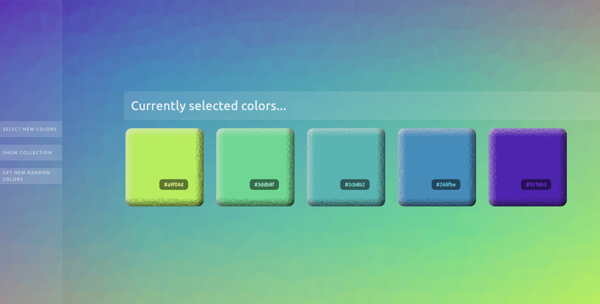
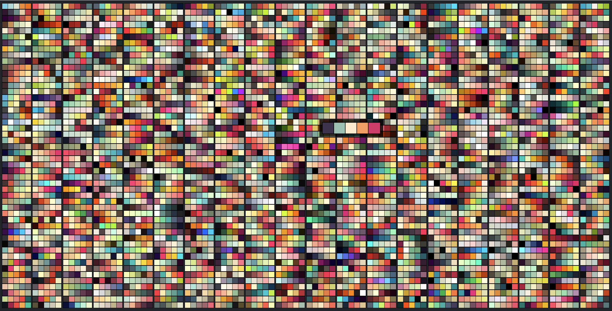
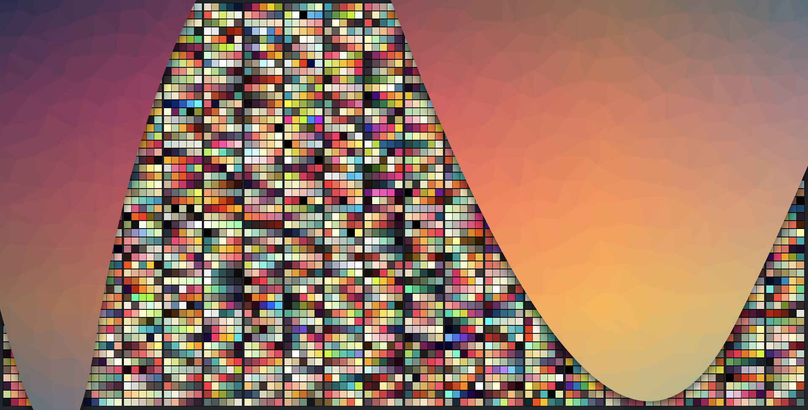

# React color factory app
> app created using React, sass, animations created with anime.js, background made with Trianglify
## See it live
[React color factory app live on github](https://daliborkoenig.github.io/react-color-factory-app/)
## App Info
practicing working with hooks on a multi-layered app

- you can choose between 1000 sets of compatible colors or let the app decide for you
- choices are saved in collection
- backgrounds are generated from choices with Trianglify
- fonts change color depending on light % in background colors (not perfect since bacvkground is made out of an array of 5 colors. Working on it further.)

### Author
Dalibor Koenig
### Version
1.0.5
### License
This project is licensed under the MIT License

